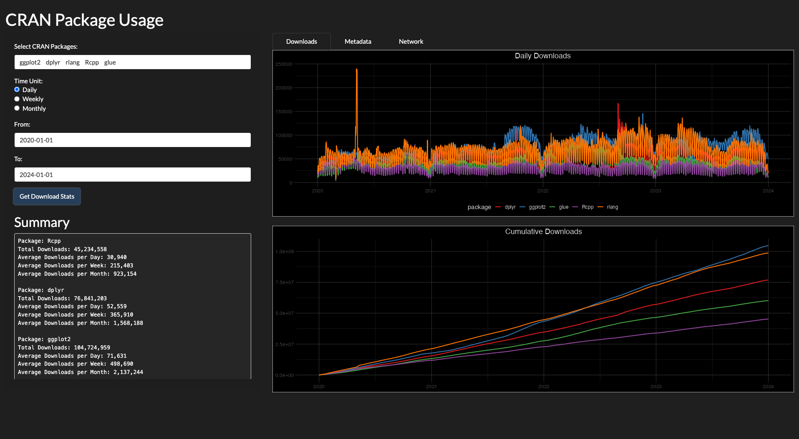
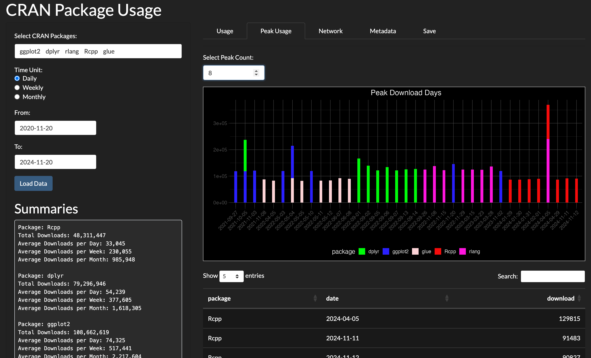
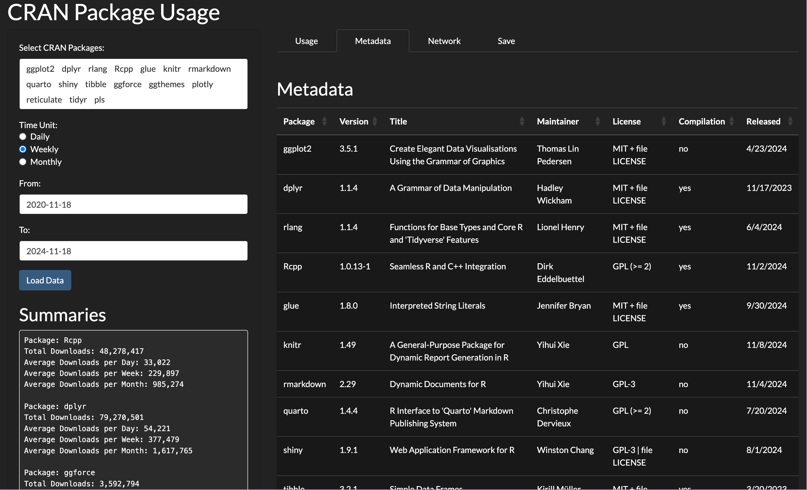
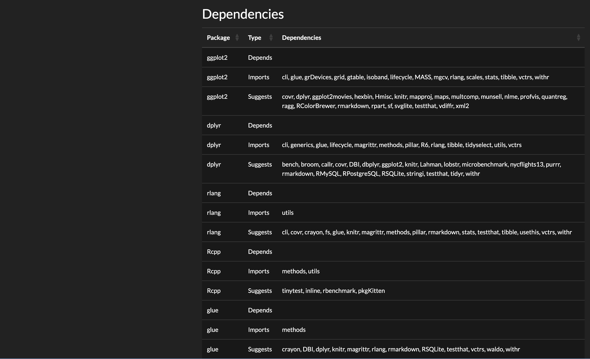
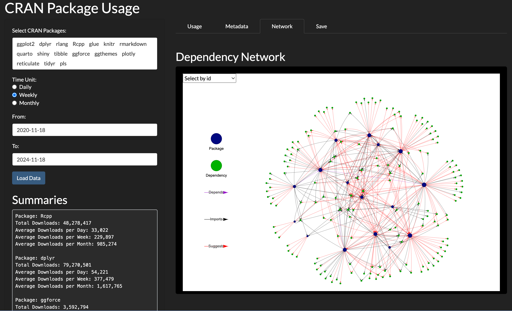
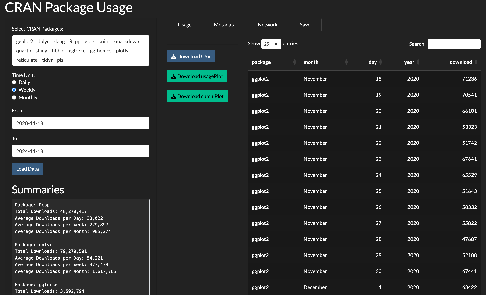

<!-- README.md is generated from README.Rmd. Please edit that file -->

```{r, include = FALSE}
knitr::opts_chunk$set(
  collapse = TRUE,
  comment = "#>",
  fig.path = "man/figures/README-",
  out.width = "100%",
  fig.retina = 2
)
```

# CRAN Package Usage App

<!-- badges: start -->

[](https://www.repostatus.org/#active)
[](https://lifecycle.r-lib.org/articles/stages.html#stable)
[](https://opensource.org/licenses/MIT)

<!-- badges: end -->

The `CRAN Package Usage App` offers an intuitive and interactive way to
explore and analyze CRAN package usage. It enables users to display
detailed download trends and compare up to 20 packages simultaneously.
Simply select the packages you wish to explore, click the `Load Data`
button.

Access the app here:
<https://christian-goueguel.shinyapps.io/cran-package-usage/>

## Key Features

The app is organized into four main tabs, each designed to provide
specific insights and functionalities:

1.  **Usage Tab**

    -   **Daily, Weekly, or Monthly Downloads**: View trends over
        different timeframes.

    -   **Cumulative Downloads**: Visualize the cumulative download
        trends over time.



2.  **Peak Usage**

    -   Explore the peak download days with ease. Visualize up to 10
        highest download days for any selected time period.



3.  **Metadata Tab**

    -   Access **package metadata**.

    -   Retrieve **package dependencies.**





4.  **Network Tab**

    -   Gain insights into how packages are interconnected.

    -   Explore a Network-based representation of dependency
        relationships.



5.  **Save Tab**

    -   **Export data** in CSV format.

    -   Save **plots** as PNG files.


