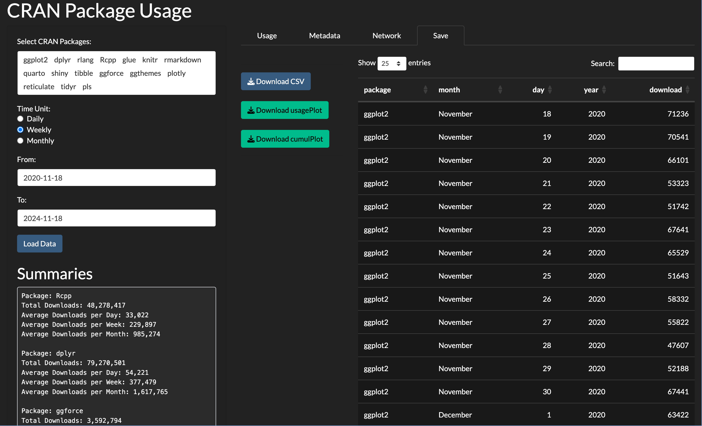

# CRAN Package Usage App
<!-- badges: start -->

<!-- badges: end -->

The `CRAN Package Usage App` offers an intuitive and interactive way to explore and analyze CRAN package usage. It enables users to display detailed download trends and compare up to 20 packages simultaneously. Simply select the packages you wish to explore, click the `Load Data` button.

Access the app here: <https://christian-goueguel.shinyapps.io/cran-package-usage/>

## Key Features

The app is organized into four main tabs, each designed to provide specific insights and functionalities:

1.  **Usage Tab**

    -   **Daily, Weekly, or Monthly Downloads**: View trends over different timeframes.

    -   **Cumulative Downloads**: See how the number downloads have accumulated over time.

2.  **Metadata Tab**

    -   Access **package metadata**.

    -   Retrieve **package dependencies.**

3.  **Network Tab**

    -   Gain insights into how packages are interconnected.

    -   Explore a Network-based representation of dependency relationships.

4.  **Save Tab**

    -   **Export data** in CSV format.

    -   Save **plots** as PNG files.

