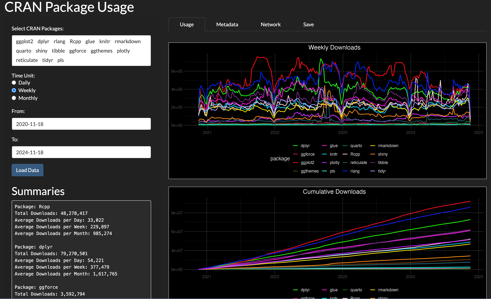
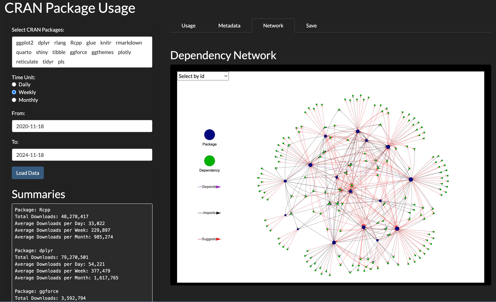

# CRAN Package Usage

<!-- badges: start -->

<!-- badges: end -->

This Shiny app provides an interactive way to explore CRAN package
usage. You can view detailed download information for any CRAN
package and compare data for up to 10 packages simultaneously. Simply
select the packages you're interested in, and press the
`Load Data` button. The app will display their download trends
and insights. You can also access the package's metadata through the `Metadata` 
tab. While the `Network` tab provides a visual representation of package dependencies, 
enabling users to better understand their interconnections.

Access the app here:
<https://christian-goueguel.shinyapps.io/cran-package-usage/>

**Example:** Weekly download trends for the selected packages
over the period from **November 18, 2020**, to **November 18, 2024**,
highlighting usage patterns and insights across this time frame.

